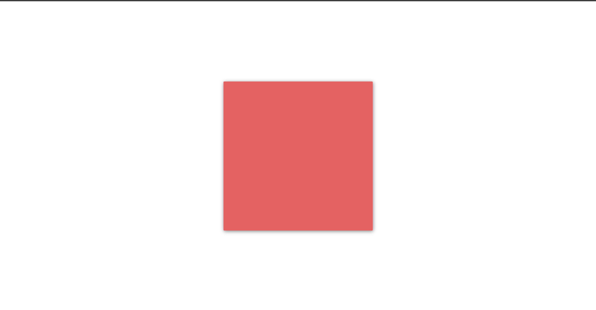
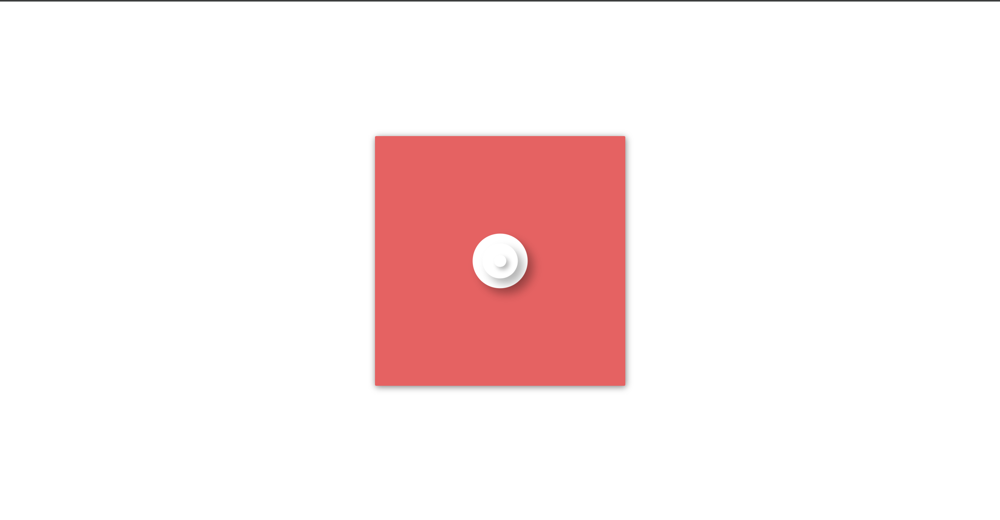

<h1>100 Days CSS Challenge - Day 4</h1>

This project is a solution for Day 4 of the <a href="https://100dayscss.com/days/4/">100 Days CSS Challenge</a>. The challenge focuses on creating a visually appealing loading animation using CSS.

<h2>Table of Contents</h2>
<ul>
  <li><a href="#challenge-overview">Challenge Overview</a></li>
  <li><a href="#preview">Preview</a></li>
  <li><a href="#installation">Installation</a></li>
  <li><a href="#usage">Usage</a></li>
  <li><a href="#project-structure">Project Structure</a></li>
  <li><a href="#styling">Styling</a></li>
  <li><a href="#challenges">Challenges</a></li>
  <li><a href="#contributing">Contributing</a></li>
  <li><a href="#credits">Credits</a></li>
  <li><a href="#contact">Contact</a></li>
</ul>

<h2 id="challenge-overview">Challenge Overview</h2>

The task for Day 4 of the 100 Days CSS Challenge is to create an engaging loading animation. The aim is to develop a smooth and visually appealing effect using CSS animations.

<h2 id="preview">Preview</h2>

Here are some previews of the loading animation:

<h2 id="installation">Installation</h2>
<ol>
  <li>Clone the repository from GitHub:</li>
  <pre><code>git clone https://github.com/Yashi-Singh-1/Day-04-Loading.git</code></pre>
  <li>Navigate to the project directory:</li>
  <pre><code>cd Day-04-Loading</code></pre>
  <li>Open the <code>index.html</code> file in your web browser to view the animation.</li>
</ol>

<h2 id="usage">Usage</h2>

To view and interact with the animation, simply open the <code>index.html</code> file in any web browser. The animation will start automatically.

<h2 id="project-structure">Project Structure</h2>

The project is structured as follows:

<ul>
  <li><code>index.html</code>: The main HTML file containing the structure of the animation.</li>
  <li><code>styles.css</code>: The CSS file containing the styles and animations for the project.</li>
  <li><code>README.md</code>: This README file containing the project documentation.</li>
</ul>

<h2 id="styling">Styling</h2>

The styling of the project is managed entirely in the <code>styles.css</code> file. The key elements styled include:

<ul>
  <li><code>.loader</code>: The container that holds the loading animation elements, centered on the screen with a background color and box shadow.</li>
  <li><code>.dot</code>: A class applied to each dot in the loading animation, providing the base styles for the animation.</li>
  <li>Animations use the <code>ease-in-out</code> timing function for smooth transitions.</li>
</ul>

<h2 id="challenges">Challenges</h2>

During the implementation of this project, the main challenges included:

<ul>
  <li>Ensuring the animation timings created a visually pleasing and synchronized effect.</li>
  <li>Centering the elements perfectly within the frame for consistency across different screen sizes.</li>
  <li>Optimizing the CSS to be clean and easy to understand while maintaining the desired visual effects.</li>
</ul>

<h2 id="contributing">Contributing</h2>

Contributions to this project are welcome. If you have suggestions for improvements, new features, or bug fixes, please follow these steps:

<ol>
  <li>Fork the repository on GitHub.</li>
  <li>Create a new branch for your feature or bug fix:</li>
  <pre><code>git checkout -b your-feature-branch</code></pre>
  <li>Make your changes and commit them with clear and descriptive messages:</li>
  <pre><code>git commit -m "Description of your changes"</code></pre>
  <li>Push your changes to your forked repository:</li>
  <pre><code>git push origin your-feature-branch</code></pre>
  <li>Open a pull request on the original repository, providing a detailed description of your changes.</li>
</ol>

We appreciate your contributions and will review your pull request as soon as possible. If you encounter any issues or have questions, feel free to open an issue on GitHub.

<h2 id="credits">Credits</h2>

This project is part of the <a href="https://100dayscss.com/days/4/">100 Days CSS Challenge</a>. Special thanks to <a href="https://github.com/Yashi-Singh-1">Yashi Singh</a> for the implementation and design of this solution.

<h2 id="contact">Contact</h2>

For more projects and updates, connect with Yashi Singh:

<ul>
  <li>GitHub: <a href="https://github.com/Yashi-Singh-1">github.com/Yashi-Singh-1</a></li>
  <li>LinkedIn: Yashi Singh (<a href="https://www.linkedin.com/in/yashi-singh-b4143a246">www.linkedin.com/in/yashi-singh-b4143a246</a>)</li>
</ul>
